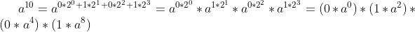
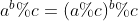

== 快速幂

求a^b,需要将b转换为二进制。比如b=10

利用a^(b+c) = a^b * a^c,得到：

可以发现项前面的系数就是1010的倒置。

[source,java]
----
   static int Pow(int a,int b){
        int ans = 1;
        int base = a;
        while(b!=0){
            if((b & 1)==1) ans *= base;
            base *= base;
            b >>= 1;
        }
        return ans;
    }
----

这样的话，我们把CPU做乘法的次数从10次，变成4次。

== 快速幂模运算

普通算法不仅复杂度是O(b)，而且一旦a或者b的值过大，就会发生溢出。因此，需要
利用这个公式快速幂模。

